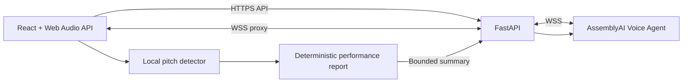

# VoxFlow — AI Vocal Coach with Lyra

VoxFlow is a real-time AI vocal coach powered by AssemblyAI. Lyra guides hands-free warmups, controls browser-generated exercises by voice, measures vocal pitch locally, and delivers spoken, evidence-based feedback after every session.

Built for the [AssemblyAI Voice Agent Challenge](https://lablab.ai/ai-hackathons/assemblyai-voice-agent-hackathon).

## Demo links

- **Live app:** deployment in progress
- **Demo video:** publishing in progress
- **Pitch deck:** publishing in progress
- **Source code:** [github.com/VRojas1603/VoxFlow-AI-Agent](https://github.com/VRojas1603/VoxFlow-AI-Agent)

## What VoxFlow does

VoxFlow combines a conversational coach with deterministic browser-side audio measurement. The voice agent guides the session and controls the interface, while the browser evaluates the user's actual signal instead of asking the model to guess from a transcript.

The four available exercises are:

1. **Diaphragmatic Breathing** — a timed breathing pattern with metronome guidance.
2. **Lip Trill Scale** — a guided nine-note scale with pitch, stability, and octave-alignment measurements.
3. **Vocal Sirens** — continuous upward and downward glides evaluated for range, continuity, direction, and smoothness.
4. **Notes Practice** — sequential C4–D4–E4–F4 targets that can be transposed from −6 to +6 semitones. Each note must remain within ±30 cents for 500 ms before the next target unlocks.

At the end of a session, Lyra receives a bounded performance summary and speaks coaching feedback based on the measured results. The interface replaces the voice orb with a visual report that can also be downloaded as a text file.

## Key features

- Low-latency speech-to-speech coaching through the AssemblyAI Voice Agent API.
- Voice tools for exercise selection, technique tips, accompaniment playback, key, speed, volume, Notes Practice, language changes, and session completion.
- Local pitch detection with signal-quality filtering, timing metadata, and rejected-sample diagnostics.
- Protected exercise windows that continue local measurement while preventing sustained practice sounds from becoming chat messages.
- Three-second visual countdown before every exercise begins.
- Session reports with measured strengths, focus areas, and a concrete next action.
- English and Spanish voice options selected before each session. The selected voice remains fixed while the session is active.
- Secure FastAPI WebSocket proxy; the AssemblyAI API key never reaches the browser.

## Architecture



The React client captures 24 kHz PCM audio through an `AudioWorklet`. Conversational audio travels through the FastAPI WebSocket proxy to AssemblyAI. Pitch samples remain in the browser and are evaluated against exercise targets. Only the resulting bounded metrics are sent to Lyra when the user ends the session.

## Technology

- **Frontend:** React 19, Vite 8, Tailwind CSS 4, Web Audio API, Pitchy, Lucide React, pnpm.
- **Backend:** Python 3.11, FastAPI, Uvicorn, WebSockets, Pydantic Settings.
- **Voice AI:** AssemblyAI Voice Agent API.
- **Production:** Vercel for the frontend and Render for the backend.

## Local setup

### Requirements

- Node.js 20 or later
- pnpm
- Python 3.11 or later
- An AssemblyAI API key

### Backend

Create `backend/.env` from `backend/.env.example`:

```ini
ASSEMBLYAI_API_KEY=your_assemblyai_api_key
ENVIRONMENT=development
PORT=8000
CORS_ORIGINS=http://localhost:5173
ASSEMBLYAI_WS_URL=wss://agents.assemblyai.com/v1/ws
```

Then run:

```powershell
cd backend
python -m venv .venv
.\.venv\Scripts\Activate.ps1
pip install -r requirements.txt
uvicorn app.main:app --reload --port 8000
```

Verify the backend at `http://localhost:8000/api/health`.

### Frontend

Create `frontend/.env.development` from `frontend/.env.example`:

```ini
VITE_API_BASE_URL=http://localhost:8000/api
VITE_WS_PROXY_URL=ws://localhost:8000/ws/agent
```

Then run:

```powershell
cd frontend
pnpm install
pnpm dev
```

Open `http://localhost:5173`, select a voice, allow microphone access, and choose **Start with Lyra**.

## Production configuration

### Render backend

Create a Docker Web Service with `backend` as the root directory and `/api/health` as the health-check path. Configure:

```ini
ASSEMBLYAI_API_KEY=<secret>
ENVIRONMENT=production
CORS_ORIGINS=https://<your-vercel-domain>
ASSEMBLYAI_WS_URL=wss://agents.assemblyai.com/v1/ws
```

### Vercel frontend

Create a Vite project with `frontend` as the root directory and pnpm as the package manager. Configure:

```ini
VITE_API_BASE_URL=https://<your-render-domain>/api
VITE_WS_PROXY_URL=wss://<your-render-domain>/ws/agent
```

After both deployments are live, update `CORS_ORIGINS` in Render with the exact Vercel origin and redeploy the backend.

## Quality checks

```powershell
cd frontend
pnpm test
pnpm lint
pnpm build

cd ..\backend
python -m unittest discover -s tests -v
```

The current release passes 53 frontend tests and 30 backend tests.

## Repository layout

```text
ai-voice-agent/
├── backend/                  # FastAPI API and AssemblyAI WebSocket proxy
│   ├── app/api/              # Health, exercise, and tip endpoints
│   ├── app/core/             # Settings, Lyra prompt, and voice tools
│   ├── app/services/         # Proxy, tool coordination, and summary validation
│   ├── tests/
│   └── Dockerfile
├── frontend/                 # React client
│   ├── public/               # AudioWorklet microphone processor
│   ├── src/audio/            # Synthesis, pitch analysis, and evaluation
│   ├── src/components/       # Voice, exercise, and report interfaces
│   ├── src/hooks/            # Voice session orchestration
│   ├── src/reports/          # Report model and download serialization
│   └── tests/
├── LICENSE
└── README.md
```

## License

VoxFlow is available under the [MIT License](LICENSE).
