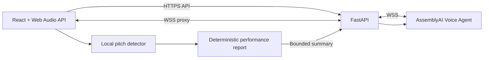

# VoxFlow — AI Vocal Coach with Lyra

VoxFlow is a real-time AI vocal coach powered by AssemblyAI. Lyra guides hands-free warmups, controls browser-generated exercises by voice, measures vocal pitch locally, and delivers spoken, evidence-based feedback after every session.

Built for the [AssemblyAI Voice Agent Challenge](https://lablab.ai/ai-hackathons/assemblyai-voice-agent-hackathon).

## Demo links

- **Live app:** [vox-flow-ai-agent.vercel.app](https://vox-flow-ai-agent.vercel.app)
- **Backend health:** [voxflow-backend-37k3.onrender.com/api/health](https://voxflow-backend-37k3.onrender.com/api/health)
- **Demo video:** publishing in progress
- **Pitch deck:** publishing in progress
- **Source code:** [github.com/VRojas1603/VoxFlow-AI-Agent](https://github.com/VRojas1603/VoxFlow-AI-Agent)

## What VoxFlow does

VoxFlow combines a conversational coach with deterministic browser-side audio measurement. The voice agent guides the session and controls the interface, while the browser evaluates the user's actual signal instead of asking the model to guess from a transcript.

The four available exercises are:

1. **Diaphragmatic Breathing** — a timed breathing pattern with metronome guidance.
2. **Lip Trill Scale** — a guided nine-note scale with pitch, stability, and octave-alignment measurements.
3. **Vocal Sirens** — continuous upward and downward glides evaluated for range, continuity, direction, and smoothness.
4. **Notes Practice** — sequential F♯3–G♯3–A♯3–B3 targets (approximately 185–247 Hz) that can be transposed from −6 to +6 semitones. Each note must remain within ±30 cents for 500 ms before the next target unlocks.

At the end of a session, Lyra receives a bounded performance summary and speaks coaching feedback based on the measured results. The interface replaces the voice orb with a visual report that can also be downloaded as a text file.

## Key features

- Low-latency speech-to-speech coaching through the AssemblyAI Voice Agent API.
- Voice tools for exercise selection, technique tips, accompaniment playback, key, speed, volume, Notes Practice, language changes, and session completion.
- Local pitch detection with signal-quality filtering, timing metadata, and rejected-sample diagnostics.
- Protected exercise windows that continue local measurement while preventing sustained practice sounds from becoming chat messages.
- Three-second visual countdown before every exercise begins.
- Session reports with measured strengths, focus areas, and a concrete next action.
- English and Spanish voice options selected before each session. The selected voice remains fixed while the session is active.
- Secure FastAPI WebSocket proxy; the AssemblyAI API key never reaches the browser.

## Guided demo flow

This walkthrough lets judges and first-time users validate VoxFlow's main voice controls, local pitch measurement, and evidence-based session feedback in about 5–7 minutes. Lyra's exact wording may vary, but the interface actions and measured results should follow the behavior described below.

### Before you start

- Open the [live VoxFlow application](https://vox-flow-ai-agent.vercel.app).
- Allow microphone access when the browser requests it.
- Use headphones so the accompaniment does not feed back into the microphone.
- Choose a voice and select **Start with Lyra**.
- Use a quiet environment for clearer pitch detection.

### 1. Start with breathing

Say:

```text
User: "Let's start with diaphragmatic breathing."
User: "How do I do this exercise properly?"
```

Lyra selects **Diaphragmatic Breathing**. Selecting an exercise does not display a tip automatically; the explicit explanation request makes Lyra speak the instructions and show the tip card.

Then say:

```text
User: "Play the accompaniment."
```

Lyra gives a short confirmation, a `3–2–1` countdown appears, and the accompaniment starts after the countdown.

### 2. Test exercise transitions and playback controls

Say:

```text
User: "Move to the Lip Trill Scale."
User: "What can you tell me about this exercise?"
User: "Play the accompaniment."
User: "Set the speed to 0.85x."
User: "Lower the key by two semitones."
User: "Raise the key by two semitones."
User: "Increase the volume by ten percent."
User: "Stop the accompaniment."
```

Expected behavior:

- Changing exercises stops the previous accompaniment and clears the previous tip.
- The contextual question makes Lyra explain the currently selected exercise.
- Key changes are relative: lowering the initial key from `0` produces `−2`, and raising it by two returns it to `0`.
- Speed, key, volume, and playback changes appear in the interface.
- Lyra confirms the resulting setting instead of only repeating the requested change.

### 3. Test protected vocal practice

Say:

```text
User: "Move to Vocal Sirens."
User: "How do I perform this exercise?"
User: "Play the accompaniment."
```

After the countdown, make a sustained `mmm` sound while gliding from low to high and back down.

Expected behavior:

- The **Vocal Pitch & Tuning Monitor** reacts to the vocal signal.
- Pitch measurement and exercise evaluation run locally in the browser.
- Sustained practice sounds do not appear as Chinese words or ordinary chat messages.
- Lyra remains silent during the measured attempt and does not invent immediate performance feedback.

### 4. Test Notes Practice

Say:

```text
User: "Switch to Notes Practice."
User: "How does this exercise work?"
User: "Lower the key by two semitones."
User: "Start practice."
```

Expected behavior:

- Four transposed target notes appear.
- A `3–2–1` countdown starts before measurement begins.
- The notes become active sequentially.
- Holding the active note within `±30 cents` for 500 ms marks it as **Done**.
- Completing all four notes ends the attempt automatically.
- Notes Practice runs without accompaniment.
- Vocalizations remain local and do not trigger conversational replies.

### 5. Finish the session

Say:

```text
User: "That will be all for today."
```

Expected behavior:

- Lyra does not give an immediate generic farewell.
- The voice orb transitions to the report loading view while VoxFlow processes the measured attempts.
- Lyra speaks one evidence-based strength, one improvement area, and one next action.
- The visual report displays the same grounded feedback.
- **Download Report** exports the complete session report.
- **Start New Session** restores the voice selection and initial session view.

### Optional agent behavior checks

#### Barge-in

While Lyra is speaking, say:

```text
User: "Move to Vocal Sirens."
```

Lyra should stop the current response and process the new request.

#### Language switching

Say:

```text
User: "Ahora explícame cómo puedo mejorar mi afinación."
User: "Let's continue in English."
```

Lyra should change between Spanish and English, update the language indicator, and keep the voice selected at the beginning of the session.

#### Partial Notes Practice attempt

Start Notes Practice and stop after completing one target note:

```text
User: "Start practice."
User: "Stop practice."
```

The report should include a partial attempt. Stopping before completing any note cancels the attempt without adding an empty result.

#### Unsupported accompaniment

While Notes Practice is selected, say:

```text
User: "Play the accompaniment."
```

Lyra should explain that Notes Practice uses target-note matching without background accompaniment and keep the session active.

## Architecture



The React client captures 24 kHz PCM audio through an `AudioWorklet`. Conversational audio travels through the FastAPI WebSocket proxy to AssemblyAI. Pitch samples remain in the browser and are evaluated against exercise targets. Only the resulting bounded metrics are sent to Lyra when the user ends the session.

## Technology

- **Frontend:** React 19, Vite 8, Tailwind CSS 4, Web Audio API, Pitchy, Lucide React, pnpm.
- **Backend:** Python 3.11, FastAPI, Uvicorn, WebSockets, Pydantic Settings.
- **Voice AI:** AssemblyAI Voice Agent API.
- **Production:** Vercel for the frontend and Render for the backend.

## How AssemblyAI is used

VoxFlow connects to the AssemblyAI Voice Agent API through a bidirectional WebSocket proxy. AssemblyAI provides the real-time conversational layer while the browser handles pitch measurement and deterministic exercise evaluation.

- **Real-time Voice Agent API:** Maintains the live coaching conversation between the user and Lyra over a single WebSocket session.
- **Streaming speech recognition:** Converts 24 kHz PCM microphone audio into live user transcripts for the conversation history.
- **Spoken responses:** Generates Lyra's voice and streams the resulting audio back to the browser for immediate playback.
- **Turn taking and voice activity detection:** Determines when the user has finished speaking and when Lyra should respond.
- **Barge-in support:** Allows the user to interrupt an active spoken response and continue the conversation naturally.
- **LLM orchestration:** Interprets requests, maintains session context, follows the vocal-coaching prompt, and produces concise responses.
- **JSON Schema tool calling:** Converts spoken requests into structured actions for exercise selection, technique tips, accompaniment controls, Notes Practice, language updates, and session completion.
- **Configurable output voices:** Lets the user select an English or Spanish voice before starting a session. The selected voice remains fixed until the session ends.
- **English and Spanish recognition:** Restricts input language detection to English and Spanish while supporting code-switching during the conversation.
- **Low-latency transcription mode:** Uses `min_latency` to keep voice interactions responsive during practice.
- **Session lifecycle events:** Coordinates session configuration, audio streaming, transcripts, tool calls, tool results, interruptions, and orderly session completion.

AssemblyAI does not calculate vocal pitch or grade exercise performance in VoxFlow. Pitch detection, cents deviation, note stability, exercise rubrics, and report metrics run locally in the browser. At the end of the session, only a bounded summary of those measurements is sent to Lyra so the spoken feedback remains grounded in recorded results.

## Local setup

### Requirements

- Node.js 20 or later
- pnpm
- Python 3.11 or later
- An AssemblyAI API key

### Backend

Create `backend/.env` from `backend/.env.example`:

```ini
ASSEMBLYAI_API_KEY=your_assemblyai_api_key
ENVIRONMENT=development
PORT=8000
CORS_ORIGINS=http://localhost:5173
ASSEMBLYAI_WS_URL=wss://agents.assemblyai.com/v1/ws
```

Then run:

```powershell
cd backend
python -m venv .venv
.\.venv\Scripts\Activate.ps1
pip install -r requirements.txt
uvicorn app.main:app --reload --port 8000
```

Verify the backend at `http://localhost:8000/api/health`.

### Frontend

Create `frontend/.env.development` from `frontend/.env.example`:

```ini
VITE_API_BASE_URL=http://localhost:8000/api
VITE_WS_PROXY_URL=ws://localhost:8000/ws/agent
```

Then run:

```powershell
cd frontend
pnpm install
pnpm dev
```

Open `http://localhost:5173`, select a voice, allow microphone access, and choose **Start with Lyra**.

## Production configuration

### Render backend

Create a Docker Web Service with `backend` as the root directory and `/api/health` as the health-check path. Configure:

```ini
ASSEMBLYAI_API_KEY=<secret>
ENVIRONMENT=production
CORS_ORIGINS=https://<your-vercel-domain>
ASSEMBLYAI_WS_URL=wss://agents.assemblyai.com/v1/ws
```

### Vercel frontend

Create a Vite project with `frontend` as the root directory and pnpm as the package manager. Configure:

```ini
VITE_API_BASE_URL=https://<your-render-domain>/api
VITE_WS_PROXY_URL=wss://<your-render-domain>/ws/agent
```

After both deployments are live, update `CORS_ORIGINS` in Render with the exact Vercel origin and redeploy the backend.

## Quality checks

```powershell
cd frontend
pnpm test
pnpm lint
pnpm build

cd ..\backend
python -m unittest discover -s tests -v
```

The current release passes 53 frontend tests and 30 backend tests.

## Repository layout

```text
ai-voice-agent/
├── backend/                  # FastAPI API and AssemblyAI WebSocket proxy
│   ├── app/api/              # Health, exercise, and tip endpoints
│   ├── app/core/             # Settings, Lyra prompt, and voice tools
│   ├── app/services/         # Proxy, tool coordination, and summary validation
│   ├── tests/
│   └── Dockerfile
├── frontend/                 # React client
│   ├── public/               # AudioWorklet microphone processor
│   ├── src/audio/            # Synthesis, pitch analysis, and evaluation
│   ├── src/components/       # Voice, exercise, and report interfaces
│   ├── src/hooks/            # Voice session orchestration
│   ├── src/reports/          # Report model and download serialization
│   └── tests/
├── LICENSE
└── README.md
```

## License

VoxFlow is available under the [MIT License](LICENSE).
